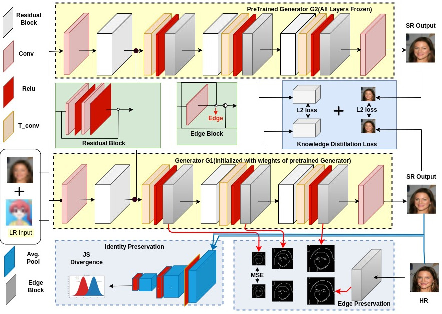

# ISR-KD : Face to Cartoon Incremental Super-Resolution for Knowledge Distillation

Welcome to the ISR-KD-Network repository! This repository contains the code implementation for Face to Cartoon Incremental Super-Resolution for Knowledge Distillation.



## Abstract

<details>
  <summary>Click to expand</summary>
  
Facial super-resolution is an important area of research that seeks to enhance low-resolution facial images for a variety of applications. While Generative Adversarial Networks (GANs) have shown promise in this area, their ability to adapt to new, unseen data remains a challenge. This paper addresses this problem by proposing an incremental super-resolution using GANs with knowledge distillation (ISR-KD) for face to cartoon. Previous research in this area has not investigated incremental learning, which is critical for real-world applications where new data is continually being generated. The proposed ISR-KD aims to develop a novel unified framework for facial super-resolution that can handle different settings, including different types of faces such as cartoon face and various levels of detail. To achieve this, a GAN-based super-resolution network was pretrained on the CelebA dataset and then incrementally trained on the iCartoon dataset, using knowledge distillation to retain performance on the CelebA test set while improving the performance on iCartoon test set. Our findings demonstrate the effectiveness of knowledge distillation in incrementally adding capability to the model for cartoon face super-resolution while retaining the learned knowledge for facial super-resolution tasks in GANs. 
</details>

<!-- > Edge and Identity Preserving Network for Face Super-Resolution  
> Jonghuyn Kim, Gen Li, Inyong Yun, Cheolkon Jung, Joongkyu Kim  
> Neurocomputing Journal 2021

[[Paper](https://www.sciencedirect.com/science/article/pii/S0925231221004227)] -->

## Installation

To get started, follow these steps:

1. Clone this repository to your local machine.
2. Install the required dependencies by running the following command:
```bash
conda install --file requirements.txt
```

## Dataset

Our network is trained using the [CelebA](http://mmlab.ie.cuhk.edu.hk/projects/CelebA.html) dataset and the [iCartoonFace](https://github.com/luxiangju-PersonAI/iCartoonFace) dataset. To generate the desired datasets, please download the datasets and run the `create_dataset.py` script located in the `./scripts` directory. Save the test and train images in the `./datasets/test` and `./datasets/train` folders, respectively.

We have utilized four different datasets to train our network. The files containing list of images chosen from CelebA and iCartoonFace to create new Datasets are in `./datasets` folder. The file names and corresponding datasets are listed below:

| File Name                           | Dataset           | Cartoon images | CelebA images |
|-------------------------------------|--------------------|----------------|----------------|
| train\_20K\_cartoon\_0\_face.txt     | Cartoon-CelebA-1   | 20,000         | 0              |
| train\_20K\_cartoon\_10k\_face.txt   | Cartoon-CelebA-2   | 20,000         | 10,000         |
| train\_20K\_cartoon\_20k\_face.txt   | Cartoon-CelebA-3   | 20,000         | 20,000         |
| train\_50K\_cartoon\_10k\_face.txt   | Cartoon-CelebA-4   | 50,000         | 10,000         |

## Generating HR Images Using a Pretrained Model

Once you have prepared the test images, you can obtain the reconstructed images using our pretrained model. Follow these steps:

1. Create a folder named `checkpoint/CelebA`.
2. Download the pretrained weights from [Google Drive](https://drive.google.com/drive/folders/1B4Wa-nhvU3LOzefI-2rBYrkqZPisC8fi?usp=sharing) and copy them into the `./checkpoint/CelebA` folder.
3. Run the `test.py` script to generate the high-resolution (HR) images. The results will be saved in the `./checkpoint/CelebA/result` folder. You can modify the save path and other details in the `./options/base_options.py` and `./options/test_options.py` files.

## Training a New Model on Your Personal Dataset

We have updated the `train.py` script to train EIPNet on your personal dataset. Follow these steps:

1. Save your train and test images in the `./datasets/train` and `./datasets/test` folders, respectively.
2. Customize the implementation details, save path, and other settings in the `./options/base_options.py` and `./options/train_options.py` files.
3. Run the `train.py` script or execute the command `python train.py` in your terminal.

## License

All rights reserved. This code is licensed under the [CC BY-NC-ND 4.0](https://creativecommons.org/licenses/by-nc-nd/4.0/legalcode) (Attribution-NonCommercial-NoDerivatives 4.0 International) license. The code is released for academic research use only.

## Citation

If you use this code for your research, please cite our papers. We appreciate your support!

